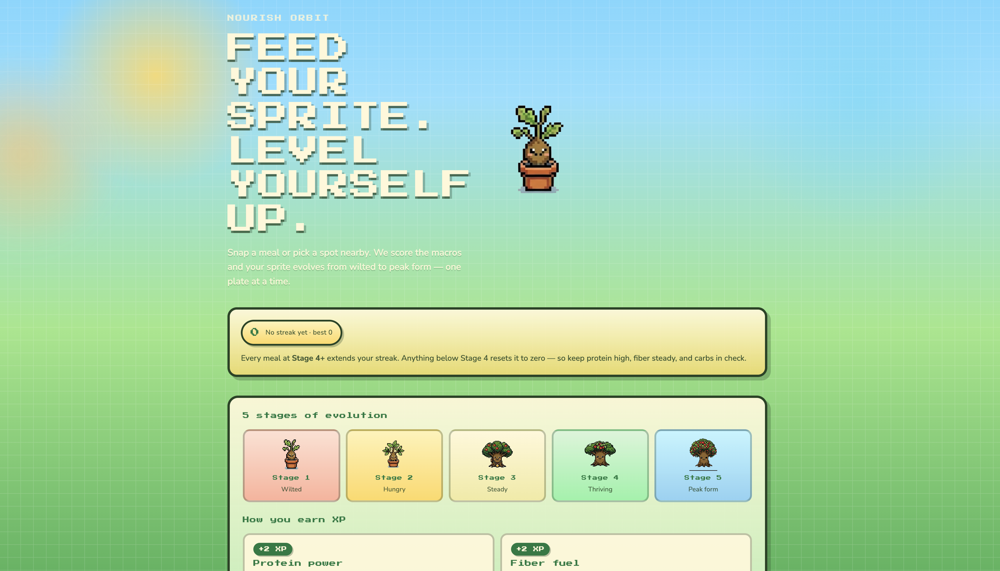
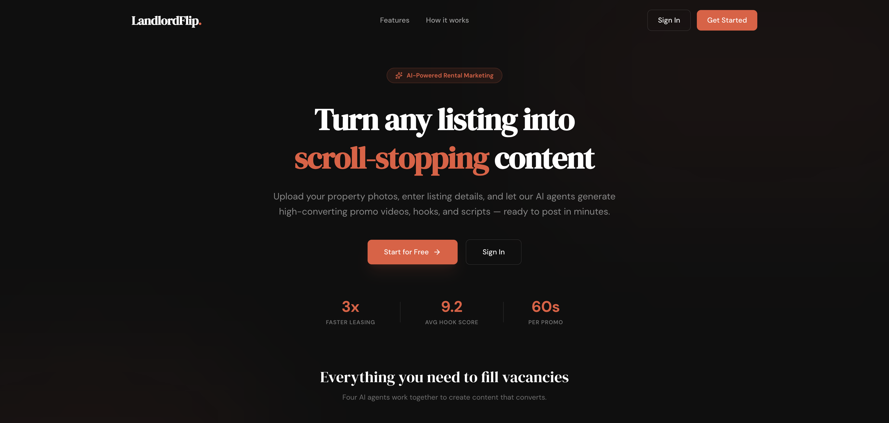
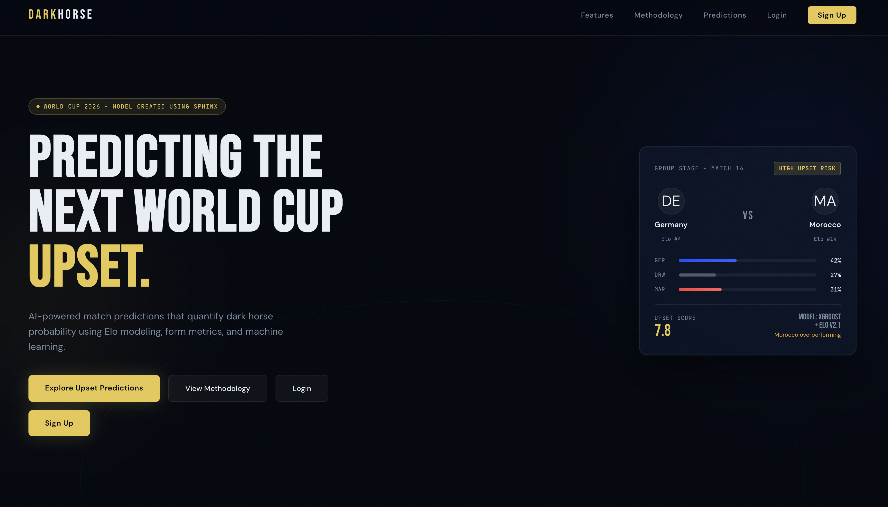

# Hey, I'm Ray 

**Georgia Tech CS student** building real things and shipping projects.

```python
ray = {
    "school":      "Georgia Institute of Technology (B.S. CS, 2027)",
    "currently":   "Junior Developer @ Core Clinical Partners",
    "focus":       ["Full-Stack", "AI/ML", "Mobile"],
    "location":    "Atlanta, GA"
}
```

---

## Recent Wins

| Project | Event | Result |
|---|---|---|
| [Nourish Orbit](#) | Claude Hackathon @ Georgia Tech (NBC Partnered) | 🥇 1st Place |
| [LandlordFlip](#) | Hacklanta — 150+ participants | 🥇 1st Place |
| [DarkHorse](https://dark-horse-world-cup.vercel.app/) | Hacklytics | 🏆 Winning Project |

---

## What I've Built

### [Nourish Orbit](#) — AI Nutrition Platform
> `React` `TypeScript` `FastAPI` `Claude API` `Gemini Vision`

3-stage multi-agent Claude backend for fridge interpretation, meal planning, and real-time coaching. Gemini Vision extracts macros from meal photos across 15+ food categories. Your sprite evolves across 5 stages as your nutrition improves — won 1st at the NBC-partnered Claude Hackathon at Georgia Tech.

<!-- Upload Screenshot_2026-04-23_at_3_12_24_PM.png to this repo, then replace the line below -->


---

### [LandlordFlip](#) — AI Rental Marketing Platform
> `React` `FastAPI` `Supabase` `Remotion` `Claude API`

4-stage AI pipeline (outline → draft → critique → refinement) that generates scripts, storyboards, and 30–60 sec promo videos from raw property data. Cuts listing creation from hours to minutes.

<!-- Upload Screenshot_2026-04-23_at_3_14_14_PM.png to this repo, then replace the line below -->


---

### [DarkHorse](https://dark-horse-world-cup.vercel.app/) — World Cup Upset Predictor
> `Python` `XGBoost` `FastAPI` `React`

Gradient boosting model trained on historical FIFA data. Engineers ELO delta, rolling form index, and H2H features to predict upsets with 72% validation accuracy.

<!-- Upload Screenshot_2026-04-23_at_3_15_14_PM.png to this repo, then replace the line below -->


---

## Experience

**Junior Developer @ Core Clinical Partners** *(Aug 2025 – Present)*
Building a HIPAA-compliant React Native app serving **700+ healthcare professionals** across 15+ facilities — real-time messaging, three-tier RBAC, and row-level security on sensitive patient-adjacent data.

---

## Stack


---

## Let's Connect

[](https://linkedin.com/in/rayram3535)
[](mailto:rayramirez482@gmail.com)
[](https://dark-horse-world-cup.vercel.app/)
